<div align="center">


<p>
💻 Developer &nbsp;•&nbsp; 🎨 Graphic &amp; UI Designer &nbsp;•&nbsp; 🛡️ Aspiring Ethical Hacker &nbsp;•&nbsp; ☁️ Always building something new
</p>

<p>
  <a href="https://didulagamage.pages.dev"></a>
  <a href="https://www.linkedin.com/in/didula-gamage"></a>
  <a href="https://www.instagram.com/didula.gamage"></a>
</p>

📍 Sri Lanka

<!-- Light Mode Badge -->


<!-- Dark Mode Badge -->

</div>

<br>

<div align="center">
  
</div>

<br>

## 🧭 About Me

```yaml
name: Didula Gamage
role: Developer & UI/UX Designer
focus: Web Development, Cybersecurity, Digital Design
location: Sri Lanka
currently_learning: Ethical Hacking & Network Security
fun_fact: I like turning small ideas into working prototypes over a weekend
```

<br>

## 💻 Tech Stack

<div align="center">

**Languages & Web**


**Tools & Platforms**


**Design**


</div>

<br>

## 📊 GitHub Statistics

<div align="center">


<br>


</div>

> Cards above are live — they refresh automatically and always show current stats, so no numbers are hardcoded here.

<br>

## 📌 Pinned Projects

<div align="center">

| Project | Description | Stack |
|---|---|---|
| [🖼️ Malcolm-Lismore-Photography](https://github.com/DidulaGamage-lk/Malcolm-Lismore-Photography) | Responsive photography portfolio website with galleries | `HTML` `CSS` `JS` `PHP` |
| [✋ Air-Drawing-Dashboard](https://github.com/DidulaGamage-lk/Air-Drawing-Dashboard) | Web-based dashboard for drawing using hand gestures | `CSS` `JS` |
| [🕵️ investigator-browser-activity-logger](https://github.com/DidulaGamage-lk/investigator-browser-activity-logger) | Chrome extension for logging browser activity with passcode protection | `JavaScript` |
| [🔐 password-strength-checker](https://github.com/DidulaGamage-lk/password-strength-checker) | Entropy-based password strength checker & generator | `HTML` `CSS` `JS` |
| [🌐 Sx9Net-Info](https://github.com/DidulaGamage-lk/Sx9Net-Info) | Network scanner for gathering net details, built for Kali users | `Shell` |
| [🎨 MyPortfolio.info](https://github.com/DidulaGamage-lk/MyPortfolio.info) | My modern personal portfolio site | `CSS` |

</div>

<br>

## 🤝 Connect With Me

<div align="center">

<a href="https://didulagamage.pages.dev"></a>
<a href="https://www.linkedin.com/in/didula-gamage"></a>
<a href="https://www.instagram.com/didula.gamage"></a>

<br><br>

⚡ *Thanks for stopping by — feel free to explore my repos and connect!*

</div>
