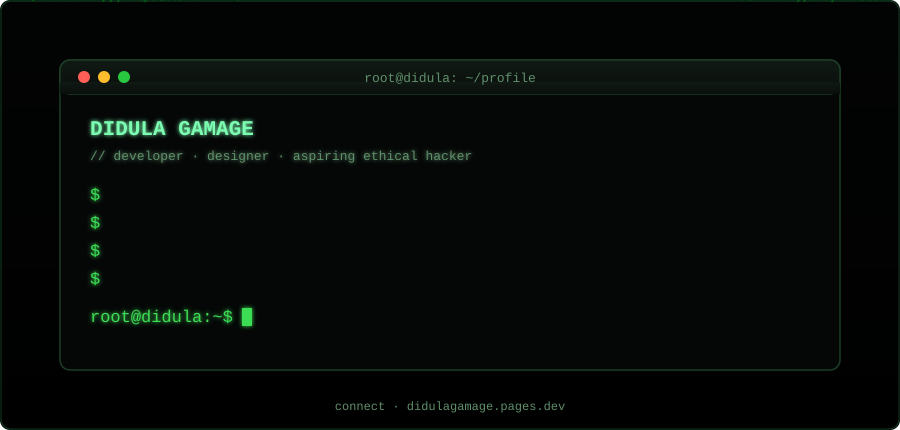

<div align="center">


<p>
  
  
  
  
</p>

<p>
  <a href="https://didulagamage.pages.dev"></a>
  <a href="https://www.linkedin.com/in/didula-gamage"></a>
  <a href="https://www.instagram.com/didula.gamage"></a>
</p>


</div>

<br>

<div align="center">
  
</div>

<br>

<!-- Contribution Snake — animates your commit graph eating itself. Needs a one-time GitHub Action setup, see bottom of file. -->
<div align="center">
  
</div>

<br>

## 🧭 About Me

```yaml
name: Didula Gamage
role: Developer, UI/UX Designer & Aspiring Ethical Hacker
focus: Web Development · Cybersecurity · Digital Design
location: Sri Lanka
currently_studying: Cybersecurity (CCSEH) — network security, Nmap, ethical hacking phases
building: security tools, self-hosted services, and playful web experiments
philosophy: ship small, working things — fast
```

- 🔭 Currently building **security-focused tools** — an OWASP Top 10 educational repo and `websec-check-pro`, a modular passive web-security scanner CLI
- 🌱 Deep-diving into **network security & ethical hacking** through hands-on Kali Linux practice
- 🎨 Also design and ship full **UI/UX + branding work**, from print-industry redesigns to app dashboards
- ⚡ Fun fact: I like turning small ideas into working prototypes over a weekend

<br>

## 💻 Tech Stack

<div align="center">

**Languages & Web**


<br><br>

**Tools & Platforms**


<br><br>

**Design**


</div>

<br>

## 📊 GitHub Statistics

<div align="center">

<br>


<br><br>


</div>

> Stats cards refresh automatically on view — no numbers are hardcoded here.

<br>

## 📌 Pinned Projects

<div align="center">

| Project | Description | Stack |
|---|---|---|
| 🛡️ **websec-check-pro** | Modular passive web-security scanner CLI with a crawler and multi-format reporting | `Shell` `JS` |
| 📚 **OWASP Top 10 Guide** | Educational repo breaking down the OWASP Top 10 for learners | `Markdown` |
| ✂️ **URL Shortener** | Self-hosted, Docker-ready URL shortener service | `Docker` `PHP` |
| ✋ **Doctor Strange Gesture Controller** | Browser-based hand-gesture controller using MediaPipe & Web Audio API | `JS` |
| 🚀 **Nebula Siege** | Wave-based HTML5 Canvas space shooter with synthesized audio & mobile touch support | `HTML5` `JS` |
| 🖼️ [Malcolm-Lismore-Photography](https://github.com/DidulaGamage-lk/Malcolm-Lismore-Photography) | Responsive photography portfolio with galleries | `HTML` `CSS` `JS` `PHP` |
| ✋ [Air-Drawing-Dashboard](https://github.com/DidulaGamage-lk/Air-Drawing-Dashboard) | Dashboard for drawing using hand gestures | `CSS` `JS` |
| 🕵️ [Browser Activity Logger](https://github.com/DidulaGamage-lk/investigator-browser-activity-logger) | Chrome extension for logging browser activity with passcode protection | `JavaScript` |
| 🔐 [Password Strength Checker](https://github.com/DidulaGamage-lk/password-strength-checker) | Entropy-based password strength checker & generator | `HTML` `CSS` `JS` |
| 🌐 [Sx9Net-Info](https://github.com/DidulaGamage-lk/Sx9Net-Info) | Network scanner for gathering net details, built for Kali users | `Shell` |
| 🎨 [MyPortfolio.info](https://github.com/DidulaGamage-lk/MyPortfolio.info) | Modern personal portfolio site | `CSS` |

</div>

<br>

## 🤝 Connect With Me

<div align="center">

<a href="https://didulagamage.pages.dev"></a>
<a href="https://www.linkedin.com/in/didula-gamage"></a>
<a href="https://www.instagram.com/didula.gamage"></a>

<br><br>

⚡ *Thanks for stopping by — feel free to explore my repos and connect!*

</div>
